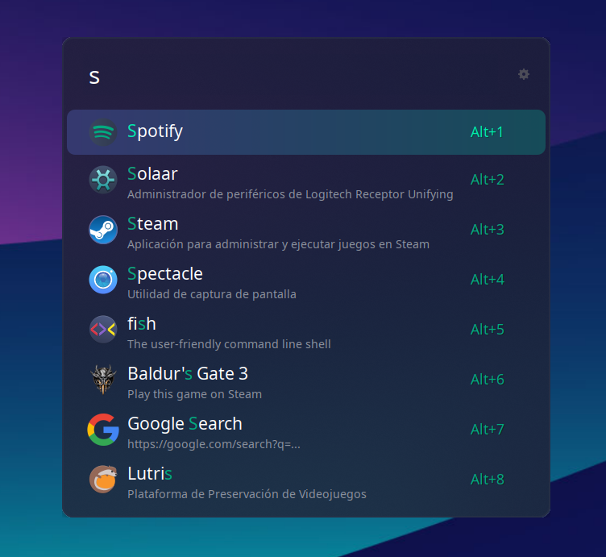

# Gradient Dark Ulauncher

My custom Ulauncher theme created for [Gradient Plasma Themes](https://github.com/L4ki/Gradient-Plasma-Themes) and used in KDE Plasma with [Better Blur](https://github.com/taj-ny/kwin-effects-forceblur)

## Some Ulauncher tips
- env variables: GDK_BACKEND=x11
- args: --hide-window --no-window-shadow

## Screenshots

<p align="center">
  
</p>

<p align="center">
  
</p>

## Installation

```sh
mkdir -p ~/.config/ulauncher/user-themes
git clone https://github.com/iguruspain/ulauncher-gradient-dark.git \
  ~/.config/ulauncher/user-themes/gradient-dark
```
